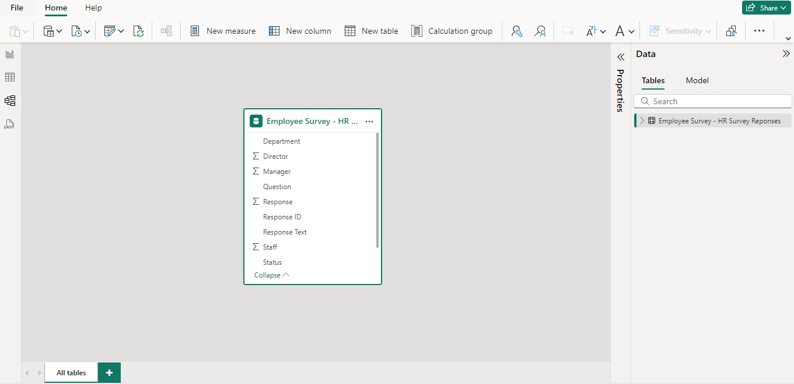
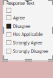
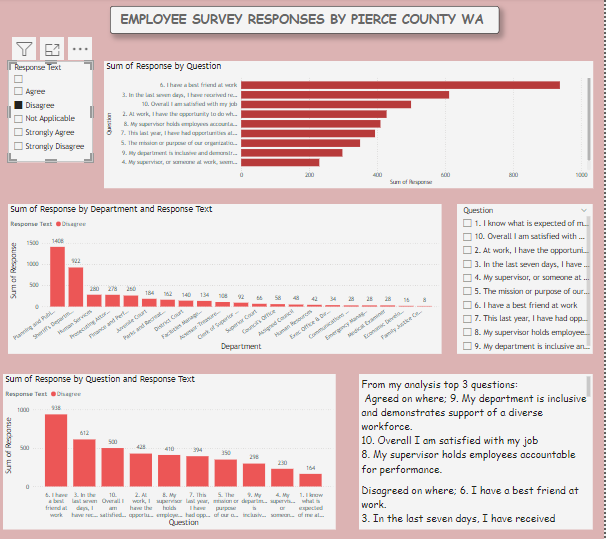

# Capstone Project 4

## Employee Survey

---

### Introduction

This is a power bi project to analyse the given dataset and provide answers to the problem statements.

### Problem Statement
1. Which survey questions did respondents agree with of disagree with most?
2. Do you see any pattern or trends by department or role?
3. As an employer, what steps might you take to improve employee satisfication based on the survey results?

### Skill/Concepts Demonstrated

The following skill/concept were incorporated:
- Power query
- Data modelling
- Data cleaning
- Data visualization

Transformed Table
:-------------------------:

### Data Sourcing
Digitately Drive  (https://docs.google.com/spreadsheets/d/1nbhfp2ModgqDAPveYQG9CknRw2PYJQxbOTs3xSKOB8E/edit#gid=61186505)

### Data Modelling

Model View
:---------------:

This model has just one fact table with 10 columns

### Visualisation 

1. Visualisation
   

The visuals report comprise of slicers, text box, bar charts;
Slicer                    |    Bar chart              |    Text Box            
:------------------------:|:-------------------------:|:-----------------------:
           |         |           

Slicers - 
These are the main controllers of the visual. The narrow vast information to aid in getting more accurate answers for the problem statements

Text Box -
This one can type in findings from analyse data to give more clarity

Bar Charts - 
Provide changing but accurate results based off of values chosen in the slicers  

When slicer is interacted with, it then gives a change in the visual to give answers

Selection from Slicer 
:-------------------------:

 Before Selection                      |           After Selection
:-------------------------------------:|:-----------------------------:
               |    
Visualisation 1                        |           Visualisation 2

A clear difference when the slicers are used to filter for data.

### Conclusion 

- Agreed on where; 
9. My department is inclusive and demonstrates support of a diverse workforce.
10. Overall I am satisfied with my job
8. My supervisor holds employees accountable for performance.

- Disagreed on where; 
6. I have a best friend at work.
3. In the last seven days, I have received recognition or praise for doing good work.
10. Overall I am satisfied with my job.
  
A large population of the answers came from Planning and Public Works. This is simply because the Planning and Public works have the largest number of employees.
And across all departments it's quite clear that there is a small number of response texts coming in with disagree as compared to the agree and strongly agree. Most of each department strongly agrees and agrees with a survey question. There is no response text pertaining to not applicable. A very small number of response text votes, coming in for strongly disagree. An accurate number of 135 employees from this survey did not complete this survey.

### Recommendation
As an employer who seeks to satisfy myemployees, I will look at each question asked and the response text. Then scale these questions from the most important to the least important. So, for example, question 1. I know what is expected from of me at the workplace. I will look at that question. And with that, there are few people who strongly disagree and also quite a number who disagree. Looking at that, I will now develop a plan to organize training sessions for each employee, who is the disagree and strongly disagree category, so they know what they are supposed to do at the workplace.And in that same skill of preference in accordance to the questions, I would also look at question 9, being, my department is inclusive and demonstrates support for a diverse workplace. We have numbers, strongly disagreeing and strongly. I would seek to educate my workforce on the importance on inclusivity amongst themselves. I also take question 5, for example, which says the mission and the purpose of organization makes me feel my job is important. Some people disagree with that so we have to reorient them on the mission and the purpose in order to make the employees align their thoughts to let them know that they are part of what makes the company what it's supposed to be. We also take a look at question 4, which talks about supervisors or anyone at the workplace, making the employees feel that they are cared for. With something like this, it is known that when humans don't feel a sense of belonging, they tend not to relate well which will affect their work. I will educate the employees on how to make each other feel cared for at workplace. A question like question 6, I feel is not necessary. Having a best friend at the workplace. I will scale that question down to the least important and not really do anything about that.
With regards to improving satisfaction of my employees, according to this preferences scaling, addressing the questions down from most important to least important will be the best route.
